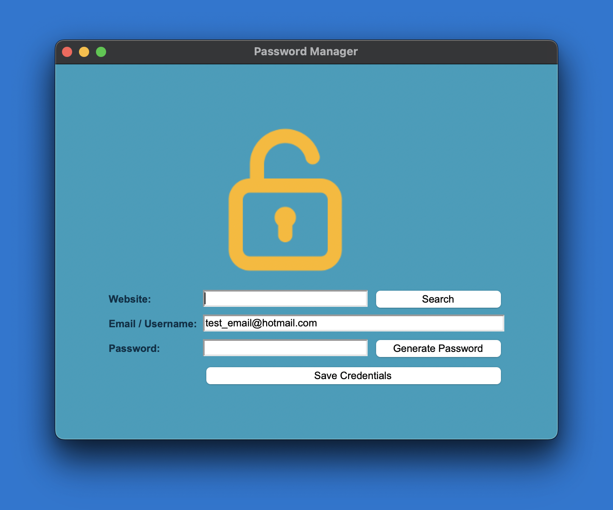

# 🔒 Password Manager

This application provides a graphical user interface (GUI) built with Tkinter for generating, storing and retrieving passwords.

 

## Features

- Generate strong passwords with alphanumerical and special characters.
- Store password credentials in a .json file.
- Retrieve stored passwords.


## Installation

- Download and install an IDE - [Visual Studio Code](https://code.visualstudio.com/), [PyCharm](https://www.jetbrains.com/pycharm/) etc
- Download and install [Python](https://www.python.org/downloads/)
- Clone the repository to a local directory - [GitHub Tutorial](https://docs.github.com/en/repositories/creating-and-managing-repositories/cloning-a-repository)
- Open the folder in your chosen IDE 
- Install pyperclip
```
  pip install pyperclip
```
- Run the main.py file

    
## Usage/Examples

1. Run the application.
2. Enter your details in the respective data fields.
3. Generate a random password by clicking the 'Generate Password' button.
4. The new password will be automatically copied to your clipboard.
3. Save the login credentials by clicking the 'Save Credentials' button.
4. Retrieve stored passwords by entering a saved website name.

## Screenshots




## FAQ

#### Are my passwords stored securely?

This application does not guarantee the security of your data. Although the passwords are stored locally in a .json file, the information is not encrypted; As such, the data is not protected against access from unwanted 3rd parties. The application was created with the sole intention for the author to practice using Tkinter.


## Authors

- [@BorivojTodorcic](https://github.com/BorivojTodorcic/)

